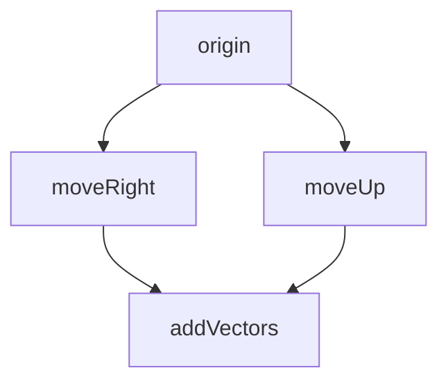

# SHIP Documentation — TSExample v0.2.0

> **Date**: 2026-02-28 | **Phase**: SHIP | **Tier**: 2 (Light Cycle)

---

## 3-Sentence Summary

**TSExample v0.2** achieves full JExample feature parity for TypeScript/Deno by
adding a `Cloneable<T>` protocol for class instance fixtures, multi-producer
argument support (`@Given('a', 'b')`), Mermaid dependency graph visualization,
and fail-fast producer validation. The biggest v0.1 limitation —
`structuredClone` stripping prototype chains — is now solved: fixtures
implementing `Cloneable` preserve `instanceof` and methods through the entire
EDD dependency chain. All 4 slices shipped with 91 tests, 92.8% line coverage,
and zero new source files.

---

## 60-Second Explainer

### What's New in v0.2

**1. Class Instance Fixtures** — Implement `Cloneable<T>` on your fixture class:

```typescript
import type { Cloneable } from './src/mod.ts';

class Money implements Cloneable<Money> {
  constructor(public amount: number, public currency: string) {}
  clone(): Money {
    return new Money(this.amount, this.currency);
  }
}
```

TSExample automatically calls `clone()` instead of `structuredClone`, preserving
`instanceof` and prototype methods.

**2. Multi-Producer Arguments** — Diamond dependency patterns:

```typescript
@Example()
@Given('moveRight', 'moveUp')
addVectors(right: Vec2, up: Vec2): Vec2 {
  return { x: right.x + up.x, y: right.y + up.y };
}
```

**3. Mermaid Visualization** — Generate dependency diagrams:

```typescript
import { renderMermaid } from './src/mod.ts';
const diagram = renderMermaid(registry.all());
// "graph TD\n  origin --> moveRight\n  origin --> moveUp\n  ..."
```

**4. Better Error Messages** — Invalid `@Given` references fail immediately:

```
TSExample: Example "convert" depends on "nonExistent" which is not registered.
```

### Quality

| Metric           | Value |
| ---------------- | ----- |
| Tests            | 91    |
| Line coverage    | 92.8% |
| Branch coverage  | 86.9% |
| New source files | 0     |

---

## 9-Minute Deep Dive

### Clone Priority System

The `cloneFixture()` function uses a 3-priority dispatch:

1. **Custom CloneStrategy function** — User always wins. Passed via
   `registerSuite(MyClass, { cloneStrategy: myCloneFn })`.
2. **`Cloneable.clone()`** — If the fixture has a `clone()` method, call it.
   Preserves prototype chains, `instanceof`, and methods.
3. **`structuredClone`** — Default fallback. Works for all plain data objects
   but strips prototype chains.

This is backward compatible — existing v0.1 code continues to work unchanged.

### Multi-Producer Discovery

The NEXT-CYCLE.md from v0.1 said "the runner passes only the first producer's
fixture." This turned out to be wrong. The v0.1 runner already supported
multi-producer via `exMeta.given.map(...)` and `method.apply(suite, args)`.
Slice 4 was completed by adding tests, not changing code. This is an example of
EDD-style discovery: writing tests revealed the feature was already there.

### Mermaid Output Format

`renderMermaid()` produces deterministic output:

- Edges sorted alphabetically by producer, then by consumer
- Root nodes (no deps, no consumers) rendered as standalone entries
- All nodes present in the output (no orphans)

Example output for VectorExample:



### What Was NOT Changed

- No new source files (all changes extend existing modules)
- No new dependencies
- FCIS architecture unchanged — all new code follows the same pattern
- Primary API surface (`@Example`, `@Given`, `registerSuite`) unchanged

---

## Release Checklist

- [x] All quality gates pass (fmt, lint, check, test, coverage)
- [x] W-Model Review #2 passed (`docs/3-60-9/review-2.md`)
- [x] README.md updated with v0.2 features (Cloneable, multi-producer,
      renderMermaid, updated limitations and dev metrics)
- [x] CHANGELOG.md updated with v0.2.0 release notes
- [x] Ship documentation created (`docs/3-60-9/ship-2.md`)
- [ ] Git commit and tag v0.2.0
- [ ] GitHub release published

---

**Shipped**: 2026-02-28
